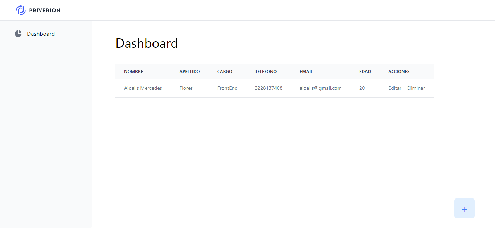

# Priverion Employees
***Un unico lugar para gestionar el estado y datos de tus empleados***



## Despliegue 📦
- Localmente

## Echar andar el proyecto ⚙️
 *Requisitos previos*
 Tener instalado XAMPP, Composer, NodeJS y PHP

 - Clonar el repositorio
 - Acceder a la carpeta API
 - Abrir la terminal y ejecutar
 ```
 php artisan serve
 ```
 - Acceder a la capera FrontEnd
 - Abrir la terminal y ejecutar
 ```
 npm install
 npm run dev
 ```


## Stack de Tecnología 🛠️

 - JavaScript
 - ReactJS
 - Tailwind
 - Redux
 - PHP
 - Laravel

